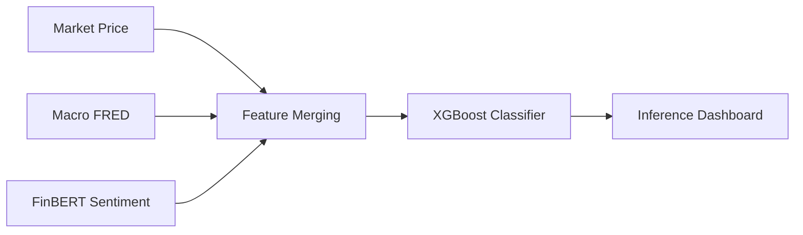

# Theoretical Foundation: Multi-Source Financial Intelligence

This document provides a conceptual and technical deep dive into the theories implemented in the Python codebase. It bridges academic financial theory with modern machine learning and natural language processing (NLP).

---

## 1. Financial Prediction Theory

The prediction of market prices is fundamentally a debate between two schools of thought:

### Efficient Market Hypothesis (EMH)
The **Weak-Form EMH** suggests that all past price information is already reflected in the current stock price. If this held perfectly, technical analysis would have zero predictive power. However, this system assumes that markets are not 100% efficient due to human behavior and delayed information diffusion.

### Behavioral Finance & Sentiment
Behavioral finance suggests that market participants' emotions (**sentiment**) drive prices away from their true fundamental value. This project leverages this theory by integrating **News Sentiment** as a key feature, capturing the "psychological" component of market shifts that historical prices alone cannot see.

---

## 2. Sentiment Analysis (Transformer NLP)

The core intelligence for news analysis is powered by **ProsusAI/finbert**.

### What is FinBERT?
FinBERT is a pre-trained **NLP model** based on the **BERT** (Bidirectional Encoder Representations from Transformers) architecture. Unlike the general-purpose BERT, FinBERT has been specifically fine-tuned on a massive financial corpus (**TRC2-financial** and **FiQA**).

### Integration Logic
In `src/data/sentiment.py`, we implement the following:
1. **Headline Ingestion**: Fetching real-time company news from the Finnhub API.
2. **Polarity Extraction**: Each headline is passed through the FinBERT pipeline, returning labels (`positive`, `negative`, `neutral`).
3. **Daily Normalization**: We aggregate these labels into a daily score between `-1` (Extremely Bearish) and `1` (Extremely Bullish).

---

## 3. Technical Indicator Mathematics

Technical indicators quantify market momentum and volatility. In `src/features/technical.py`, we apply the following logic:

### A. Relative Strength Index (RSI)
RSI measures the speed and change of price movements to identify overbought or oversold conditions.
$$ RSI = 100 - \left( \frac{100}{1 + \frac{\text{Average Gain}}{\text{Average Loss}}} \right) $$
*   **Implementation**: Used as a momentum signal for up/down directionality.

### B. MACD (Moving Average Convergence Divergence)
MACD is a trend-following momentum indicator that shows the relationship between two moving averages of a security’s price.
*   **Formula**: $MACD = EMA(12) - EMA(26)$
*   **Signal Line**: $EMA(9)$ of the MACD.

### C. Bollinger Bands
Bollinger Bands consist of a middle band (SMA) with two outer bands (Standard Deviations) that represent volatility.
*   **Middle Band**: $SMA(20)$
*   **Upper Band**: $SMA(20) + (2 \times \sigma)$
*   **Lower Band**: $SMA(20) - (2 \times \sigma)$

---

## 4. Machine Learning (XGBoost)

The modeling engine uses **Extreme Gradient Boosting (XGBoost)**.

### Why XGBoost?
- **Handling Non-Linearity**: Financial data is rarely linear. XGBoost uses ensembles of decision trees to capture complex interactions between Macro, Sentiment, and Technical features.
- **Robustness**: It contains built-in L1 ($L1$) and L2 ($L2$) regularization to prevent the model from overfitting to market noise.

### Validation Strategy: Time-Series Splitting
Traditional cross-validation (Shuffle Split) is **illegal** in financial forecasting because it utilizes future data to predict the past (**look-ahead bias**). 
In `src/models/train.py`, we use a **time-ordered split** (Last 20% of data for testing) to ensure the model only learns from historical information.

---

## 5. System Architecture & Fusion

The system fuses heterogeneous data through the **Preprocessor** in `src/data/preprocessing.py`:

By aligning these sources, the system generates a **holistic intelligence layer** that considers "what the market says" (Technicals), "what the world says" (Sentiment), and "what the economy says" (Macro).
